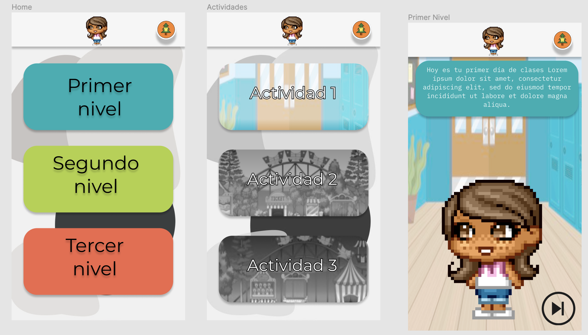

# 🌸Hack girls LAT🌸

## Nombre de app

React PWA para desarrollar habilidades blandas en niñas y niños mediante juegos.

* Soporte Offline para poder realizar las actividades sin necesidad de wifi
* Niveles y actividades para niños enfocadas en habilidades blandas
* Material interactivo
* Web Share API de las actividades y material

## Run app

* `yarn install` para instalar las dependencias
* `yarn run dev` para entorno de desarrollo
* `yarn build` para producción

## Autores

<table>
   <tr>
    <td align="center"><a href="https://github.com/ahiraaam"> <b>Ahiram Crus</b></a> </td>
    <td align="center"><a href="https://github.com/liaDiaz"> <b>Lia Diaz</b></a> </td>
     <td align="center"><a href="https://github.com/CeciMorales"> <b>Cecilia Morales</b></a> </td>
     <td align="center"><a href="https://github.com/RosiMiranda"> <b>Rosa Miranda</b></a> </td>
    <td align="center"><a href="https://github.com/andreabecerrab"> <b>Andrea Becerra</b></a> </td>
  </tr>
</table>
